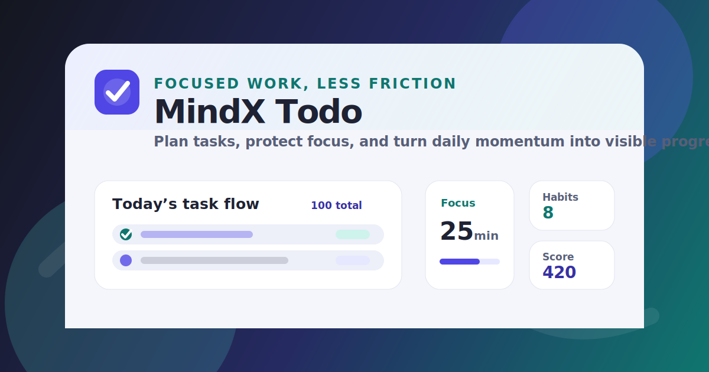

# MindX Todo

<p align="center">
  
</p>

<p align="center">
  
</p>

MindX Todo is a full-stack productivity workspace for capturing tasks, planning focused work, tracking habits, and reviewing progress. It combines a fast Vite + React client with an Express API, Prisma/PostgreSQL persistence, Redis caching, server/client internationalization, and Dockerized local infrastructure.

## Highlights

- Fast React 19 client with Vite, Redux Toolkit, SCSS tokens, dark mode, and lazy-loaded routes.
- Advanced todo modeling: priority, status, category, due/reminder dates, recurrence, subtasks, attachments, ownership, assignees, and location reminder placeholders.
- Productivity views: virtualized todo list, My Day planning, Eisenhower Matrix, Kanban board, calendar strip, Pomodoro focus, habit tracker, dashboard metrics, mock AI breakdown, and gamification.
- Localized UX in English, Catalan, French, German, Spanish, and Italian.
- Express 5 API with Zod validation, Prisma 7, PostgreSQL, Redis-backed cache invalidation, Swagger docs, and localized API responses.
- Production-style Docker Compose setup with Nginx reverse proxy, database, cache, client, and server services.

## Architecture

```text
Browser
  |
  v
Nginx :8080
  |-- /            -> Vite-built React client
  |-- /api/*       -> Express API :3000
                         |
                         |-- Prisma -> PostgreSQL
                         |-- Redis  -> cached todo reads
```

## Quick start

Run the whole stack:

```bash
docker compose up --build
```

Open:

- Client: <http://localhost:8080>
- Swagger: <http://localhost:8080/api/docs>
- Health: <http://localhost:8080/api/health>
- API direct: <http://localhost:3000/api>

The server container runs Prisma migrations and an idempotent seed before startup. The seed creates 100 deterministic todos, so repeated starts do not duplicate rows.

## Publish Docker packages

Docker images are published to GitHub Container Registry by the `Docker Publish` workflow:

- `ghcr.io/restom0/mindx-final-project-client`
- `ghcr.io/restom0/mindx-final-project-server`

The workflow runs on pushes to `main`, semantic version tags such as `v2.0.0`, and manual dispatch. It publishes branch, version, `latest`, and short-SHA tags for both images.

To deploy from published packages:

```bash
docker compose -f docker-compose.deploy.yml pull
docker compose -f docker-compose.deploy.yml up -d
```

To deploy a specific image tag:

```bash
set MINDX_CLIENT_IMAGE=ghcr.io/restom0/mindx-final-project-client:v2.0.0
set MINDX_SERVER_IMAGE=ghcr.io/restom0/mindx-final-project-server:v2.0.0
docker compose -f docker-compose.deploy.yml up -d
```

## Local development

Start the API:

```bash
cd server
copy .env.example .env
npm install
npm run prisma:generate
npm run prisma:deploy
npm run seed
npm run dev
```

Start the client:

```bash
cd client
copy .env.example .env
npm install
npm run dev
```

By default, the client expects the API at `/api`. For local split-terminal development, set `VITE_API_BASE_URL` in `client/.env` if you want to point directly at the server.

## Demo mode

Demo mode adds a guarded `/api/demo/seed` endpoint and a "Load demo flow" button in the client. It creates deterministic `demo-*` todos, subtasks, comments, activities, focus sessions, habits, and habit check-ins for a presentation flow: capture, AI breakdown, prioritization, calendar planning, focus, habits, and review.

Local Docker Compose enables demo mode by default. For manual development, set:

```bash
# server/.env
DEMO_MODE_ENABLED=true

# client/.env
VITE_DEMO_MODE=true
```

If the client was built without `VITE_DEMO_MODE=true`, you can still reveal the button at runtime by opening `/?demo=1`; the server must still have `DEMO_MODE_ENABLED=true`. Published/deploy Compose keeps `DEMO_MODE_ENABLED=false` by default.

## Environment variables

Client:

| Variable                | Purpose                                          |
| ----------------------- | ------------------------------------------------ |
| `VITE_API_BASE_URL`     | API prefix. Defaults to `/api`.                  |
| `VITE_GOOGLE_CLIENT_ID` | Enables the Google OAuth button when configured. |
| `VITE_DEMO_MODE`        | Shows the guarded demo data loader when `true`.  |

Server:

| Variable                      | Purpose                                                                                              |
| ----------------------------- | ---------------------------------------------------------------------------------------------------- |
| `PORT`                        | Express server port.                                                                                 |
| `API_PREFIX`                  | API route prefix, usually `/api`.                                                                    |
| `CORS_ORIGIN`                 | Comma-separated list of allowed browser origins. Wildcard `*` is ignored for credentialed requests.  |
| `DATABASE_URL`                | PostgreSQL connection string used by Prisma.                                                         |
| `REDIS_URL`                   | Redis connection string for cached reads.                                                            |
| `CACHE_TTL_SECONDS`           | Cache TTL for supported API responses.                                                               |
| `RATE_LIMIT_WINDOW_MS`        | General API rate-limit window in milliseconds.                                                       |
| `RATE_LIMIT_MAX`              | Maximum requests per general API rate-limit window.                                                  |
| `HEALTH_RATE_LIMIT_WINDOW_MS` | Health-check rate-limit window in milliseconds.                                                      |
| `HEALTH_RATE_LIMIT_MAX`       | Maximum health-check requests per window.                                                            |
| `TRUST_PROXY`                 | Set to `true` when the API runs behind a trusted reverse proxy such as the bundled Nginx service.     |
| `DEMO_MODE_ENABLED`           | Enables the guarded `/api/demo/seed` endpoint. Keep `false` outside demo/local environments.          |

## Useful commands

Client:

```bash
cd client
npm run lint
npm run format:check
npm run build
```

Server:

```bash
cd server
npm run check
npm run lint
npm run prisma:deploy
npm run prisma:migrate -- --name change-name
npm run seed
```

Security checks:

```bash
cd client && npm audit
cd server && npm audit
```

## Project map

```text
client/
  public/                 app icons, manifest, thumbnail, robots.txt
  src/app/                Redux store
  src/components/         reusable UI components
  src/features/           todo, auth, productivity, settings slices
  src/hooks/              virtual list helper
  src/i18n/locales/       en, ca, fr, de, es, it
  src/pages/              route-level screens
  src/services/           API client
  src/styles/             SCSS tokens, themes, layout, components
  src/utils/              parsing, productivity, server-down helpers

server/
  prisma/                 schema, migrations, seed data
  src/common/             shared middleware/helpers
  src/config/             env, cache, Prisma, Swagger
  src/controllers/        request handlers
  src/dto/                Zod request schemas
  src/repositories/       Prisma data access
  src/routes/             API routes
  src/services/           business logic and cache invalidation

docker-compose.yml        local full-stack runtime
nginx.conf                client/API reverse proxy
```

## Design and brand assets

The app now includes MindX-specific visual assets:

- `client/public/mindx-icon.svg` — editable source icon.
- `client/public/mindx-icon-192.png` — manifest icon.
- `client/public/mindx-icon-512.png` — manifest icon.
- `client/public/mindx-thumbnail.svg` — editable README/social preview.
- `client/public/mindx-thumbnail.png` — raster README/social preview.

The app shell uses the same core palette as the generated assets:

- Primary: `#4f46e5`
- Accent: `#0f766e`
- Background: `#f5f6fb`
- Dark surface: `#14161f`

## API notes

- Swagger docs are served at `/api/docs`.
- API responses follow a consistent `{ data, meta, message }` shape where applicable.
- Server messages are localized from `Accept-Language` with English fallback.
- Client language selection is persisted and sent to the API.
- Todo updates increment the `version` field automatically.
- Redis cache is invalidated after write operations that affect todo reads.

## Accessibility notes

- The app includes skip-link navigation, semantic labels, translated ARIA labels, and explicit label/control associations for native form controls.
- The todo list is virtualized for performance while retaining list/listitem semantics.
- Theme selection is persisted locally and applied at the document root.
